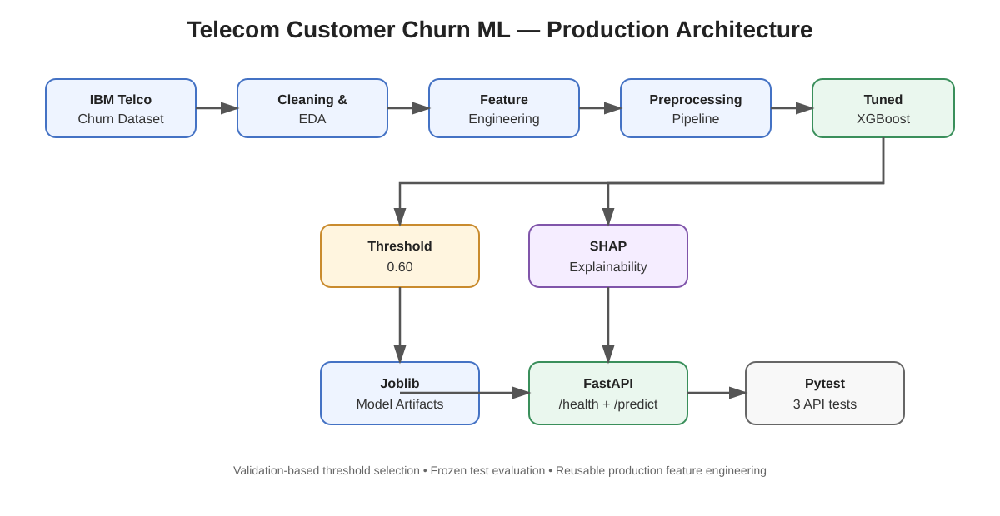
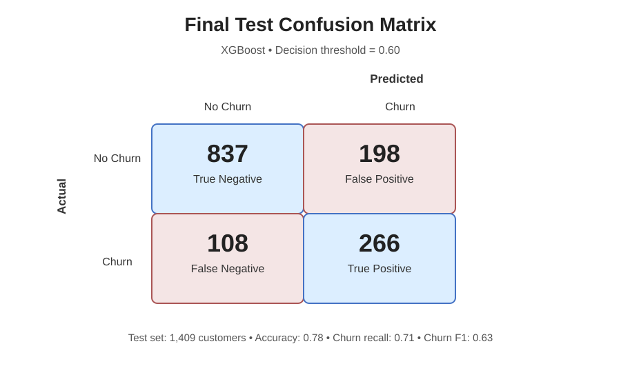
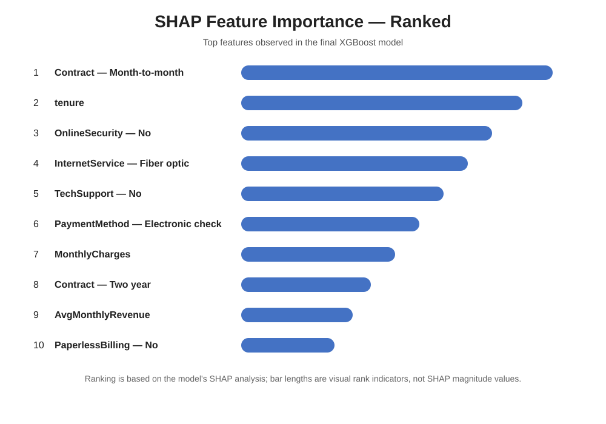

# Telecom Customer Churn Prediction

An end-to-end machine learning project that predicts telecom customer churn and exposes the trained model through a production-style FastAPI REST API.

The project demonstrates a complete ML workflow: data cleaning, exploratory analysis, feature engineering, preprocessing, model comparison, XGBoost tuning, decision-threshold optimization, SHAP explainability, model serialization, API serving, and automated testing.


---

## Project Overview

Customer churn prediction is a binary classification problem. The model estimates the probability that a customer will leave the telecom service.

### Prediction output

- `0` → predicted not to churn
- `1` → predicted to churn

The API also maps the probability to application-level risk bands:

| Probability | Risk level |
|---:|---|
| < 0.30 | LOW |
| 0.30–0.59 | MEDIUM |
| ≥ 0.60 | HIGH |

The risk bands are business rules implemented by the application; they are not additional model outputs.

---

## Architecture



The architecture diagram shows the path from raw telecom data through feature engineering and model training to the serialized model, FastAPI inference layer, SHAP explainability, and automated tests.

---

## Dataset

The project uses the IBM Telco Customer Churn dataset.

The data contains customer demographics, account information, subscribed services, billing information, and churn status.

Important variables include:

- tenure
- Contract
- MonthlyCharges
- TotalCharges
- InternetService
- OnlineSecurity
- TechSupport
- PaymentMethod
- PaperlessBilling
- Churn

---

## Machine Learning Workflow

```text
Raw Data
   ↓
Data Cleaning
   ↓
Exploratory Data Analysis
   ↓
Feature Engineering
   ↓
Preprocessing Pipeline
   ↓
Model Comparison
   ↓
XGBoost Hyperparameter Tuning
   ↓
Threshold Optimization
   ↓
Final Test Evaluation
   ↓
SHAP Explainability
   ↓
Model Serialization
   ↓
FastAPI Inference API
   ↓
Automated Tests
```

---

## Feature Engineering

Four production features were created:

- **TotalServices** — count of subscribed services
- **AvgMonthlyRevenue** — total charges divided by tenure, with MonthlyCharges used for new customers
- **TenureGroup** — tenure bucketed into 0–12, 13–24, 25–48, and 49–72 months
- **TotalCharges** — converted to numeric with missing values handled explicitly

The same feature-engineering logic is reused by the production API.

---

## Models Evaluated

Three classification approaches were evaluated:

| Model | Accuracy | Churn Recall | ROC-AUC | PR-AUC |
|---|---:|---:|---:|---:|
| Logistic Regression | 0.80 | 0.52 | 0.842 | 0.636 |
| Random Forest | 0.78 | 0.47 | 0.822 | 0.615 |
| Tuned XGBoost | 0.78 | 0.71 | 0.847 | 0.663 |

The final model is a tuned XGBoost classifier selected after validation-based hyperparameter tuning.

---

## XGBoost Tuning

Final tuned parameters:

```text
n_estimators = 200
max_depth = 3
learning_rate = 0.03
subsample = 0.8
colsample_bytree = 0.8
```

Validation performance before the final test evaluation:

- **ROC-AUC:** 0.852
- **PR-AUC:** 0.674

---

## Decision Threshold Optimization

The default classification threshold of 0.50 was not used automatically.

A validation set was used to evaluate multiple thresholds. A threshold of **0.60** was selected because it produced the highest tested validation F1 score:

- **Precision:** 0.610
- **Recall:** 0.722
- **F1:** 0.662

The untouched test set was then evaluated once using this frozen threshold.

---

## Final Test Performance

At the final threshold of **0.60**:

- **Accuracy:** 0.78
- **ROC-AUC:** 0.847
- **PR-AUC:** 0.663
- **Churn precision:** 0.57
- **Churn recall:** 0.71
- **Churn F1:** 0.63

### Confusion Matrix



| | Predicted No Churn | Predicted Churn |
|---|---:|---:|
| Actual No Churn | 837 | 198 |
| Actual Churn | 108 | 266 |

This corresponds to:

- TN = 837
- FP = 198
- FN = 108
- TP = 266

---

## Model Explainability with SHAP

SHAP was used to explain how individual features influenced model predictions.

The most influential features included:



1. Contract — Month-to-month
2. tenure
3. OnlineSecurity — No
4. InternetService — Fiber optic
5. TechSupport — No
6. PaymentMethod — Electronic check
7. MonthlyCharges
8. Contract — Two year
9. AvgMonthlyRevenue
10. PaperlessBilling — No

These explanations describe model behavior and associations in the training data; they should not be interpreted as causal effects.

---

## Production Model

The trained preprocessing pipeline and XGBoost model are serialized with Joblib:

```text
models/
├── customer_churn_model.joblib
└── churn_threshold.joblib
```

The model artifact includes the preprocessing pipeline needed to transform raw API input consistently with training-time data.

---

## FastAPI

The application exposes two endpoints.

### Health check

```http
GET /health
```

Example response:

```json
{
  "status": "healthy",
  "model": "Tuned XGBoost",
  "model_version": "1.0"
}
```

### Prediction

```http
POST /predict
```

The request contains the customer's demographic, service, contract, and billing fields.

Example response:

```json
{
  "churn_probability": 0.8676,
  "prediction": 1,
  "risk_level": "HIGH",
  "threshold": 0.6,
  "model": "Tuned XGBoost",
  "model_version": "1.0"
}
```

Swagger UI is available at:

```text
http://127.0.0.1:8000/docs
```

Run the API locally with:

```bash
uvicorn api.main:app --reload
```

---

## Automated Testing

The API includes tests for:

- health-check behavior
- valid prediction requests
- invalid/incomplete customer input

Latest local test result:

```text
3 passed
```

Run tests with:

```bash
pytest -q
```

---

## Project Structure

```text
customer-churn-ml/
├── api/
│   ├── __init__.py
│   └── main.py
├── data/
├── models/
│   ├── customer_churn_model.joblib
│   └── churn_threshold.joblib
├── notebooks/
├── docs/
│   ├── architecture.svg
│   ├── confusion-matrix.svg
│   └── shap-feature-ranking.svg
├── src/
│   ├── __init__.py
│   └── feature_engineering.py
├── tests/
│   └── test_api.py
├── .gitignore
├── pytest.ini
├── requirements.txt
└── README.md
```

---

## Local Setup

### 1. Clone the repository

```bash
git clone https://github.com/Dwivedisandeep1/customer-churn-ml.git
cd customer-churn-ml
```

### 2. Create the Python environment

This project was developed and tested with Python 3.13.

```bash
uv venv --python 3.13
source .venv/bin/activate
```

### 3. Install dependencies

```bash
uv pip install -r requirements.txt
```

### 4. Start the API

```bash
uvicorn api.main:app --reload
```

### 5. Run tests

```bash
pytest -q
```

---

## Tech Stack

- Python
- Pandas
- NumPy
- Scikit-learn
- XGBoost
- SHAP
- Joblib
- FastAPI
- Pydantic
- Pytest

---

## Future Improvements

- Expand CI with linting and type checks
- Add data and model versioning
- Add a monitoring layer for production drift
- Add a lightweight frontend/dashboard
- Containerize the inference service
- Add calibration and probability monitoring

---

## Author

**Sandeep Dwivedi**

GitHub: https://github.com/Dwivedisandeep1

---

## Disclaimer

This repository is a portfolio/learning project. Model predictions are estimates produced from the training data and are not guarantees of future customer behavior.
